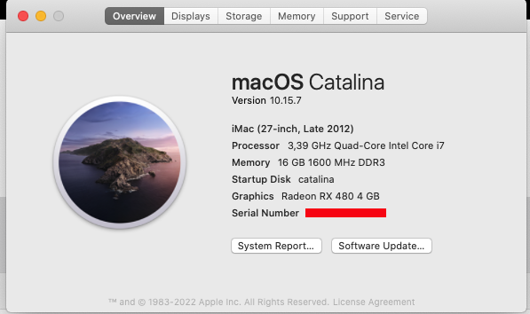

# Hackintosh GA-H77-DS3H with Catalina 10.15.7

My EFI Folder using clover 5119

Mother Board [GA-H77-DS3H](https://www.gigabyte.com/br/Motherboard/GA-H77-DS3H-rev-10/)

Graphic Card : [Radeon RX 480](https://www.amd.com/pt/support/graphics/radeon-400-series/radeon-rx-400-series/radeon-rx-480)



Running perfect, audio, lan, video icloud, etc.

Create a bootable pen, or just create a EFI partition and use a clean install with Catalina original installation created with

```sh
sudo /Applications/Install\ macOS\ Catalina.app/Contents/Resources/createinstallmedia --volume /Volumes/MyVolume

```

[Hardware list](./hardware_list.txt) created with [OCSysInfo](https://github.com/KernelWanderers/OCSysInfo)
